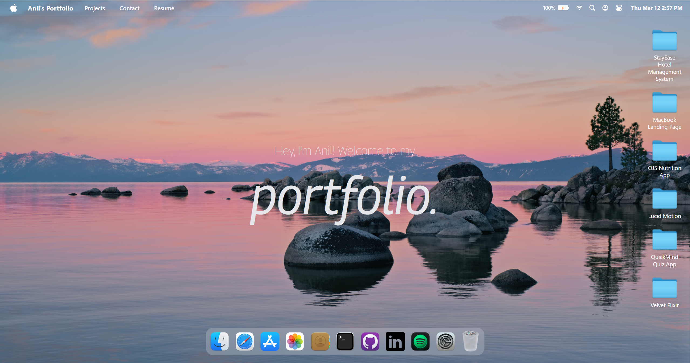

## 💻 macOS Portfolio

**macOS Portfolio** is a personal developer portfolio that recreates the macOS desktop experience in the browser.  
You can open windows, browse projects in a Finder‑style file system, view a resume, explore a photos app, use a fake terminal, and more – all built with React, TypeScript and Tailwind CSS.

---

## 🖼 Preview



---

## 🚀 Live Demo & Source

- 💻 **GitHub Repository:** [`https://github.com/aniltanriverdiler/macos-portfolio.git`](https://github.com/aniltanriverdiler/macos-portfolio.git)
- (Optional) Live demo URL can be added here once deployed.

---

## ✨ Features

- **macOS‑like Desktop UI**
  - Top menu bar with navigation (`Projects`, `Contact`, `Resume`)
  - Dock with apps (Portfolio/Finder, Safari, Gallery, Contact, Skills/Terminal, Settings, etc.)
  - Desktop project folders on the right side
- **Finder / Portfolio**
  - Project folders such as *StayEase Hotel Management System*, *MacBook Landing Page*, *OJS Nutrition App*, *Lucid Motion*, *QuickMind Quiz App*, *Velvet Elixir*
  - Each project contains text files, screenshots, live links and source code shortcuts
- **Windows**
  - **Portfolio (Finder)** – browse projects via locations and files
  - **Safari** – quick links and frequently visited sites
  - **Gallery** – photos grid with modal viewer
  - **Contact** – social cards (GitHub, Twitter/X, LinkedIn, email)
  - **Resume** – desktop and mobile‑friendly resume layout
  - **Settings** – light/dark mode, brightness, Wi‑Fi, language and volume controls
- **Mobile View**
  - Custom iPhone‑style frame, status bar and home indicator
  - Separate mobile screens for Home, Portfolio, Folder, File (text/image), Safari, Photos, Resume, Contact and Terminal
- **Internationalization**
  - English / Turkish language toggle with central translation keys
- **Type‑Safe Architecture**
  - Centralized type definitions for locations, windows, content and stores in `src/types`

---

## 🧱 Tech Stack

- **React 18+** + **TypeScript**
- **Vite** (development & production build)
- **Tailwind CSS**
- **Zustand** for state management (windows, locations, mobile navigation, theme, Wi‑Fi, audio, language)
- **ESLint** + strict TypeScript configuration

---

## 📂 Project Structure

```bash
macos-portfolio/
├─ public/
│  ├─ images/            # Wallpapers, app icons, screenshots
│  └─ files/             # Resume PDF and other static files
├─ src/
│  ├─ components/        # Desktop UI components (Navbar, Dock, windows, etc.)
│  ├─ windows/           # Desktop window implementations (Finder, Safari, Photos, Resume, Settings, ...)
│  ├─ mobile/            # Mobile shell, navigation, and iOS‑style screens
│  ├─ constants/         # App data: projects, locations, tech stack, socials, gallery, etc.
│  ├─ store/             # Zustand stores (window, theme, wifi, audio, language, mobile nav, ...)
│  ├─ lib/               # i18n helpers and utilities
│  ├─ types/             # Central TypeScript type definitions
│  ├─ App.tsx            # Root app layout
│  └─ main.tsx           # React entry point
├─ tsconfig*.json
├─ vite.config.ts
└─ eslint.config.js
```

---

## 🛠️ Installation & Run

### Requirements

- Node.js **18+**
- `npm` (or `pnpm` / `yarn`)

### Steps

```bash
# 1. Clone the repository
git clone https://github.com/aniltanriverdiler/macos-portfolio.git
cd macos-portfolio

# 2. Install dependencies
npm install

# 3. Start the dev server
npm run dev

# 4. Open in your browser
# Default Vite address:
http://localhost:5173
```

### Production Build

```bash
# TypeScript + Vite build
npm run build

# Preview the production build locally
npm run preview
```

---

## 📜 NPM Scripts

- **`npm run dev`** – Vite development server
- **`npm run build`** – TypeScript + Vite production build
- **`npm run preview`** – Preview the production build
- **`npm run lint`** – Static analysis with ESLint

---

## 🔐 Type Safety & Architecture

- Centralized types in `src/types`:
  - `NavLink`, `DockApp`, `Location`, `LocationChild`, `WindowKey`, store types, and more
- `constants/index.ts` uses these types to strongly type all data sources (projects, locations, socials, tech stack, gallery, etc.)
- React components:
  - Explicit props and return types
  - Typed callbacks and map iterations
- Strict TypeScript configuration (`strict: true`, unused checks, path aliases)

This keeps the project **maintainable**, **predictable**, and **safe for production**.

---

## 🤝 Contributing

If you have ideas for improvements or spot a bug:

1. Fork the repository  
2. Create a new branch (`feat/...` or `fix/...`)  
3. Implement and test your changes  
4. Use clear, descriptive commit messages  
5. Open a Pull Request  

---

## 📧 Contact

- GitHub: [`https://github.com/aniltanriverdiler`](https://github.com/aniltanriverdiler)  
- Portfolio repo: [`https://github.com/aniltanriverdiler/macos-portfolio.git`](https://github.com/aniltanriverdiler/macos-portfolio.git)

For any feedback or suggestions, feel free to open an issue or pull request on GitHub.